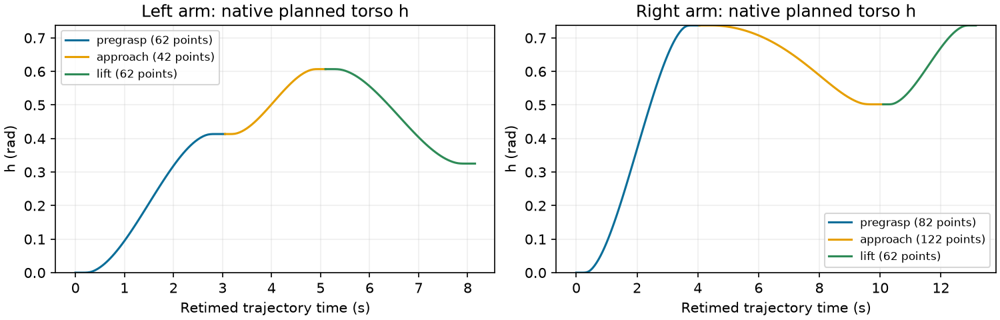
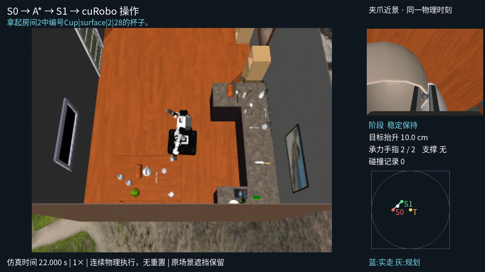

# cuRoboV2 v0.8.0 实施与真实验收

**Cup_30 / S0042 已完成真实抓取；S0032→S0042 连续导航＋抓取也成功，四视角视频可直接查看。** val103/Cup_30 完整各点采样已在 CUDA 1 启动，尚未完成；不能把这些 smoke 当成整个 val 的成功率。

分支：`feat/no-edit-lastmile-val`；worktree：`.worktrees/no-edit-lastmile-val`。未提交/合并，未修改原始资产、旧结果或停止旧队列。

## 1. 已落地的执行链

- 独立 cuRobo/CUDA 环境，精确固定标签 `v0.8.0` / `4ea77366ca48ee453e7df139e39fa6532af49f3b`；启动拒绝旧版本和关键源码不一致。
- 使用原生 `MotionPlanner.plan_grasp`，目标集选解＋接近＋抓取＋抬起；不再提前执行预抓取后才发现下一段无解。
- 11D：底盘 x/y/yaw＋活动臂 7 关节＋h。torso_2/3 用 URDF mimic 联动；不离散搜索高度。
- 仅活动 TCP 为目标。head／闲置臂相对关节锁定，原有自碰撞和环境检查保留，不全局禁用手指碰撞。
- 接触例外仅作用于“活动手指↔目标”的独立 checker；环境与自碰撞仍使用未修改的机器人球。
- 规划点按名称映射到现有 20D；夹爪关闭后按实际状态重建规划器，更新闭合关节锁定并重新规划真实抬起。不传送、不重置、不在物理模型焊接物体。
- IK32、trajectory4、抓法4、pick 查询12、300秒不增加；原生每次 plan_pose 默认5次；S1外层最多1次重试。
- no-edit CLI 默认新版配置；旧配置/后端与场景编辑入口保留。A*、Gaussian 图、1–3 段入集、失败视频及整体计时沿用现有流程。

图 1：S0042 左右臂原生返回的**规划轨迹**，不是物理执行曲线。h 在不同段连续变化，没有绑定候选索引。来源：`outputs/diagnostics/v080-pilot/mesh-fit-S0042-cuda1-152709/{left,right}/grasp_result.json`。

## 2. 真实验证结果

| 验证 | 结果 | 证据与时间 |
|---|---|---|
| 左右臂 × 五个 h 的 FK | 全部通过；11D、唯一活动 TCP、158 个原有碰撞球槽位 | `model-height-grid-cuda1-152218/summary.json` |
| S0042 原生完整抓取规划 | 左右臂接近/抓取/抬起均成功 | 左 62/42/62 点；右 82/122/62 点 |
| S0042 实际抓取 | **success，284 步**；抬高 **10.04 cm**，末尾稳定承力 **4.076 s** | `execute-synced-S0042-cuda1-153129`；**72.695 s** |
| S0032→S0042 连续导航＋抓取 | **success，477 步**；导航183步，不重置 | `continuous-S0032-S0042-cuda1-153517`；**151.119 s** |
| 单元回归 | **203 tests，8 skipped，其余通过** | `outputs/diagnostics/v080-model/unit-final.log` |

上表 pilot 目录均位于 `outputs/diagnostics/v080-pilot/`。成功判定要求两指真实承力、抬升≥5cm、无桌面支撑、相对滑移合格并保持≥2s；未放宽原物理成功阈值。

连续 smoke 的 S0 是接口验收起点，**不是新版完整采样选出的低成功率点**，因此未作为最终数据集记录。S1 首次即成功，故本次没有实际触发外层重试；重试上限由配置回归验证，故障续接还需真实失败样例。

图 2：连续视频 22秒真实帧。目标抬高10cm、承力2/2、无支撑、碰撞记录0；画面同时显示机器人、目标附近场景和夹爪近景。截图已实际检查，非渲染 fixture。

### 四个连续视频

目录：`outputs/diagnostics/v080-pilot/continuous-S0032-S0042-cuda1-153517/attempts/v080-S0032-20261010/videos/`

- [分析型第三人称](../../outputs/diagnostics/v080-pilot/continuous-S0032-S0042-cuda1-153517/attempts/v080-S0032-20261010/videos/third_person_camera.mp4)
- [head](../../outputs/diagnostics/v080-pilot/continuous-S0032-S0042-cuda1-153517/attempts/v080-S0032-20261010/videos/head_camera.mp4)
- [左夹爪](../../outputs/diagnostics/v080-pilot/continuous-S0032-S0042-cuda1-153517/attempts/v080-S0032-20261010/videos/wrist_camera_l.mp4)
- [右夹爪](../../outputs/diagnostics/v080-pilot/continuous-S0032-S0042-cuda1-153517/attempts/v080-S0032-20261010/videos/wrist_camera_r.mp4)

ffprobe 已核验全部可读；连续视频每个478帧、20FPS。独立站位视频每个285帧、20FPS；分析视频1280×720。审计：`outputs/diagnostics/v080-pilot/video_audit.json`。

## 3. 迁移时实际发现并修复的问题

| 问题 | 代码追溯与本地适配 |
|---|---|
| 小目标网格把远处躯干误判碰撞 | 标签 `_src/geom/data/data_mesh.py::compute_local_sdf[_with_grad]` 用网格半对角线作为 no-hit 距离。杯子约0.10066m，小于躯干球0.105m，产生恒定21.714代价。`V2Planner.pad_target_query_range` 只扩查询范围，几何不变。修复后同样候选的 IK 全部可解。 |
| 原生阶段衔接 CUDA 索引越界 | `_src/solver/solver_trajopt.py::_get_best_result` 将 position 扩为含锁定关节的状态，却附加只有活动关节的 knot。native grasp 的 get_active_js 按完整名字索引 knot 越界。`chain_state` 去掉仅供优化的 knot，保留位置、速度、加速度及 dt。 |
| 接近成功、抓取段 IK 又失败 | `_src/cost/cost_cspace_position.py` 看到前段单帧 dt 后，将静态端点 IK 限制为一个采样周期内能到达的关节范围。`static_ik_state` 仅让静态 IK 不带此 dt；轨迹优化和执行速度/加速度限制保留。 |
| v0.8.0 attachment 属性不可用 | `MotionPlanner.attachment_manager` 指向该标签 TrajOptSolver 尚不存在的属性。直接使用同标签独立 `AttachmentManager`，不修改上游源码。 |
| 外接 bbox 球穿入支撑桌面，抬起起点无效 | 改为原生目标 mesh/SDF 的 VOXEL 球拟合，不删桌子障碍；拟合指标记录在 `carried_geometry.json`。 |
| h 执行沿用旧离散调高的慢步长 | 使用联动关节真实速度限位÷控制频率×原 time_dilation 限制增量。本例实际步数2062→284。两次试验有并发，不能把耗时比当严格性能基准。 |
| 开门时可能复用旧 BVH | 网格名称含几何摘要；更新前同步并清理旧 cache，避免固定 environment 名称重用旧门位姿。 |

以上适配均有源代码注释；原生搜索过程、默认5次尝试和碰撞球未删除。诊断仅评估原生已经优化的候选，不额外增加 IK 搜索；有限预算失败不等于物体在全空间不可达。

## 4. 完整采样正在运行

运行：`outputs/no_edit/no-edit-v080-val103-cup30-cuda1-20261010-153916/`

日志：`outputs/no_edit/logs/no-edit-v080-val103-cup30-cuda1-20261010-153916.log`；初始后台启动退出后，已按相同冻结配置在持久 PTY 会话 **41289** 续跑；未完成 attempt 保留，原因见 `launch_recovery.json`。仅 CUDA1，worker1，原场景、默认间距、每点5次；未设置 max-trials 截断。`timing.json` 记录整个构建时间，`station_statistics.json` 和 `maps/` 随采样更新。运行完成前不报最终成功率，也不宣称已经保留1–3段正式数据。

**15:47 的阶段性检查**：21 个有效采样点、预期105次操作；S0033 首批已落盘3次（2次成功、1次失败），尚不是完整点位或最终成功率。成功 t1 的第三人称视频已核验1280×720、275帧可读。

## 5. 仍未覆盖的验收

- open 已接新版双段接触与实际关节推进，但**尚无新版真实 open 成功证据**；AlarmClock/Potato 等其他物体也未完成本轮真实验收。
- 携带物的球模型是近似。本杯子 VOXEL 拟合22球，体积采样覆盖约53.7%；不能宣称等同精确网格，不能据此保证所有物体无碰撞。原有物理接触证据仍保留。
- 原配置已有的球模型/自碰撞忽略对不在本轮删除；floor 仍沿用“规划不加入、物理检查正常支撑例外”的既有处理，不能称为新增了精确地板规划。
- 大样本成功率、正式低/高成功率选点、S0失败操作证据与完整 val 尚待新构建完成。已有 smoke 成功不替代这些统计。

运行入口见 [v0.8.0 运行手册](../../docs/cuRoboV2-v0.8.0-运行手册.md)。
