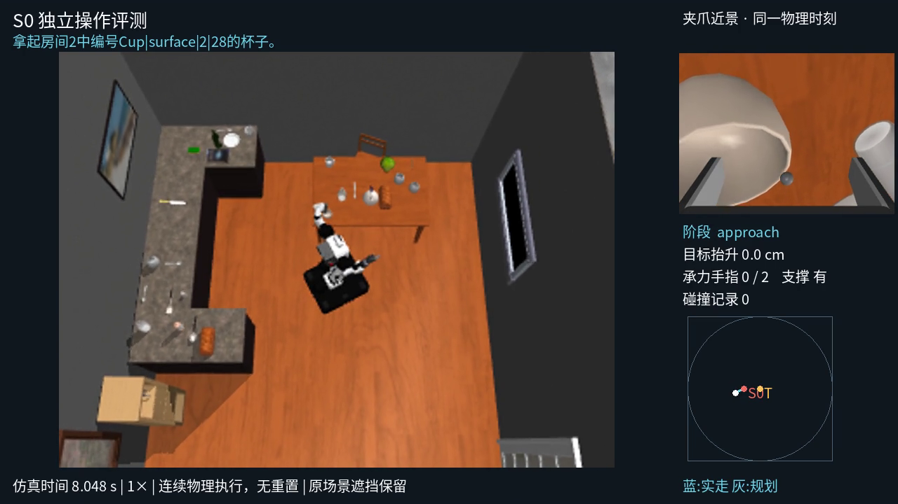
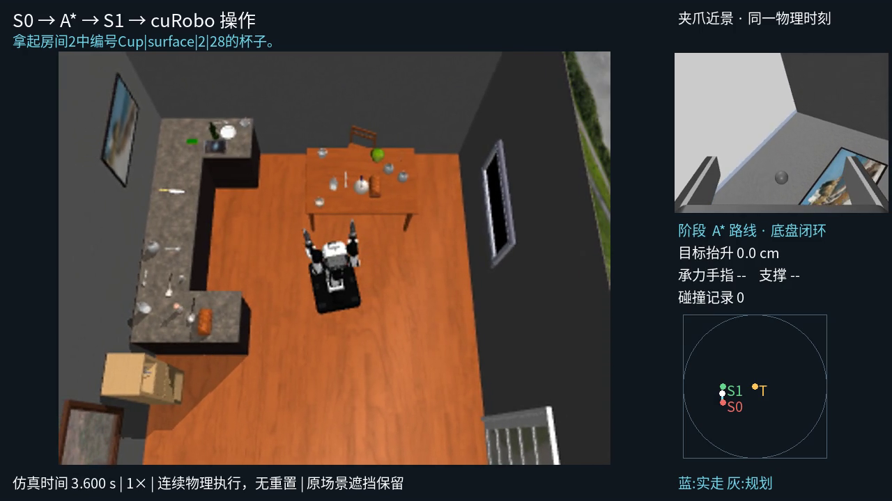

# 四路分析视频与整体计时交付报告

## 结论

已在 `feat/no-edit-lastmile-val` / `.worktrees/no-edit-lastmile-val` 增量实现并真实验证四路同步视频、可复用第三人称相机与整体计时。旧场景编辑入口默认行为不变。**全量构建已启动，尚未完成；不将当前 smoke 当最终成功连续轨迹。**

## 执行与结果

- 检视用户参考视频，采用第三人称主画面＋同一时刻活动夹爪近景＋实测状态和路径的分析型布局。
- 一共四个 MP4：`head_camera`、`wrist_camera_l`、`wrist_camera_r`、`third_person_camera`；第四路直接为分析合成版，不增添第五路。
- 叠加真实阶段、时间、抬升、手指接触/支撑、碰撞记录和规划/实走路径；未测信息显示未知。
- 第三人称仅是可复用渲染观察相机，自动框住机器人/目标/环境，记录分割可见像素；不改模型、不隐藏遮挡物。`sim.enable_third_person()` 显式启用。
- S0 实际失败操作和连续移动＋操作均接入四路保存；纯规划无解无执行时不造失败视频。
- 根目录 `timing.json` 与 `summary.json.generation_timing` 记录起止、墙钟、活动 session 时长；可断点续计。墙钟包括 GPU 等待、准备、规划、编码与恢复间隔，不累加并行 worker 作为整体耗时。

## 真实验收与回归

原始 val_103 / Cup_30 的独立站位抓取执行321步，真实移动底盘联合规划，最终 `mobile_pick` 成功。四路均解码322帧，20fps；三个机器人视角320×240，第四路1280×720；无记录错误。初始第三人称实际可见机器人1251像素、目标44像素。该限制为一次试验的 probe 总耗时80.356秒，**不是1000场景总生成时间**。

另一次真实连续 smoke 使用 S0023→S0032，0.45m A* 路径，导航123步成功；到站操作及一次重试规划无解，整段143步，四路均144帧。第四路路径/阶段实际查看通过。此 S1 是明确的导航可行调试点，不是未完成站位统计中的“最高成功率”声明；该失败片段不进入最终数据集。

[抓取与计时核验](data/four-view-native-verification.json) · [连续执行核验](data/four-view-continuous-verification.json)。

完整回归：192项，184通过，8跳过；`git diff --check` 通过。单元 fixture 不代替真实成功连续操作或 open 验收。

## 全量运行与时间

历史 mobile-full 因新增视频/计时需求停止，证据保留。新身份 `no-edit-val-four-view-full-20261010` 于 **2026-10-10 10:26:53（上海时间）** 启动；1000个原始 val 场景、workers=4，初始根据空闲情况派发物理GPU5/2/7/1。后续仍动态检查GPU0–7。

[启动状态快照](data/four-view-full-start.json)。完整运行目录：`outputs/no_edit/no-edit-val-four-view-full-20261010/`；查看 `summary.json` 和 `timing.json`。主进程PID1501437，日志 `outputs/no-edit-four-view-full-launch.log`。运行中的 ended_at_utc 为 null，最终结束时才有实际总生成时间。

## 剩余边界

尚未得到此四视角运行的最终成功连续示教；全量成功段数、整体生成耗时须等运行产物。保守导航栅格与原始遮挡可能使任务失败/跳过；视频分析信息不能替代物理验收。所有修改未提交/合并，原场景和历史输出不覆盖。
