# LastMileDataFlow 近期实验结果报告

2026-10-09

## 0. 研究概述: 面向最后一公里移动操作的数据生成与验证。

### 研究背景
- 室内场景仿真正在从生成环境走向生成任务与数据
- 场景生成方法提供大规模、多样、可控的室内环境，
- 进一步的数据管线则将场景组织为机器人可执行的任务、初始状态和交互轨迹。
- 目前移动操作重点问题是“最后一公里”问题。

> 现有研究分别尝试解决了场景生成、任务与数据扩展、操作站位选择等问题，但仍缺少面向具体操作失败机制，系统生成当前站位失败-底盘调整-操作成功数据的 最后一公里数据生成框架。

### 研究动机

- 现有室内仿真数据生成与下游任务脱节：多数工作主要追求场景、任务和轨迹规模与多样性，较少针对具体策略的失败模式定向生成数据。
- 缺乏面向最后一公里的底盘移动数据：现有移动操作数据更关注导航或机械臂操作，缺少针对最后一公里、底盘如何调整的专项数据。
- 数据质量验证成本高：判断生成场景和轨迹是否真正有助于策略，通常依赖大量完整训练与评测，难以高效筛选高价值数据。


### 研究流程
1. “最后一公里”任务模式的定义。
2. “最后一公里”任务数据管线搭建。
3. 对产出的数据低成本的验证。

### 什么是“最后一公里”任务：
> 导航和操作的衔接段；机器人已到目标附近，但当前站位无法可靠完成操作，仍然需要通过 **底盘移动的调整** 来提高操作的成功率。

“最后一公里”任务模式：

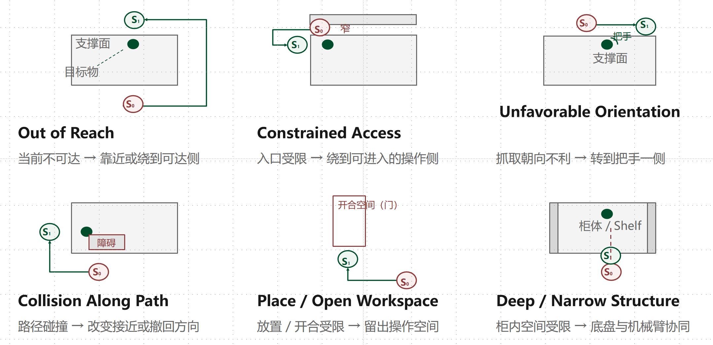


以下是“最后一公里”数据生成管线搭建情况：


## 1. 目前进展

**已能在单一真实场景上跑通「自动构造困难场景 → 站位采样 → cuRobo 规划 → 真实执行 → 成败留证」的闭环，
并取得可归因的成败对照；但 case 成立性尚未被验证，覆盖也不足以支撑任何成功率结论。**

两项工作的主结论：

| 工作 | 主结论 | 关键数字 |
|---|---|---|
| Agent 参与的 case 构造 | 机制可用，但**产出率极低** | 20 次真实运行，**接受 1 个**；`case_verified` 累计 **0** |
| 站位图 + 真实成败采集 | 得到**可复现的成败翻转** | **3 严格成功 / 3 执行失败 / 16 预算内无解** |

**核心诊断**：瓶颈不在模型能力，而在**自然语言 case 描述缺少可计算、可验证的操作化定义**

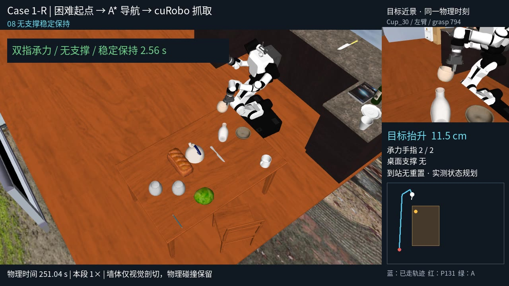

图 3-3：case1-R 闭环末段静帧

- [case1-R 闭环视频：困难起点 → A\* 导航 → cuRobo 抓取](./figures/video3-3-case1-r-closed-loop.mp4)（1280×720，约 46 s / 1149 帧）


> 演示的是「困难起点 → 导航 → 抓取」的**连续闭环形态**，

---


## 2. 数据生成管线搭建

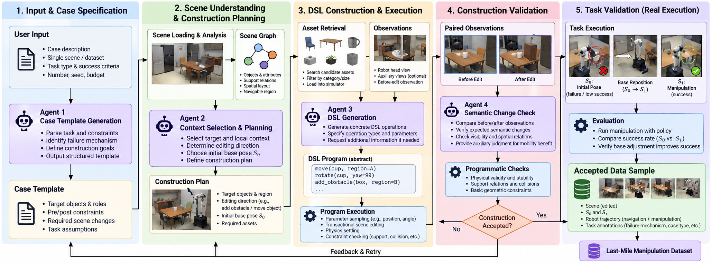

图 2-1 数据管线全景（五个阶段）。提供两个层次的交互式版本（均为自包含单文件，双击即开）：

- **[`pipeline-beginner.html`](./pipeline-beginner.html)** —— 入门图解，不涉及代码，用「出题 → 看房 → 改造 → 复核 → 实考」
  五步讲清流程，配套示意图（图见 `./figures/preview-pipeline-beginner.png`）。
- **[`pipeline-architecture.html`](./pipeline-architecture.html)** —— 代码架构与数据流：三层依赖方向、模块归属、
  函数级调用链、落盘产物与体积（图见 `./figures/preview-pipeline-architecture.png`）。

1. **输入与 case 规格**：单场景 / 数据集、任务类型与成功判据、数量与预算；
   Agent1 生成 Case Template（目标与角色、前后约束、所需场景变化、任务假设）。
2. **场景理解与构建规划**：场景加载与分析、场景图（物体、支撑关系、空间布局、可导航区域）；
   Agent2 选目标与局部上下文、定编辑方向、选初始底盘位姿 S0、产出 Construction Plan。
3. **DSL 构造与执行**：资产检索 + 观测（机器人 head、可选辅助视图、编辑前观察）；
   Agent3 生成具体 DSL 操作（`move` / `rotate` / `add_obstacle`）；程序执行参数采样、事务化编辑、物理静置与约束检查。
4. **构造验证**：配对观测（编辑前 / 编辑后）；Agent4 语义变化复核；
   程序化硬检查（物理合法性与稳定性、支撑与碰撞、基本几何约束）。
   **构造是否被接受**由此处判定；不接受则回到阶段 2/3。
5. **任务验证（真实执行）**：真实执行策略 → 比较 S0 与 S1 的成功率 → 验证底盘调整确实提升成功率 → 输出接受样本与 Last-Mile Manipulation Dataset。


---

## 3. 结果一：Agent 参与的 case 构造


### 3.1 三个失败切片

#### 切片 1：case1 的定义漂移

> case1描述： 由于目标、支撑家具和周围障碍的几何布局，原来的接近或工作位置不利于抓取，需要通过底盘平移和转向调整到更合适的工作位置。请构造实际空间或接近方向的差异，不能仅把目标移得更远。


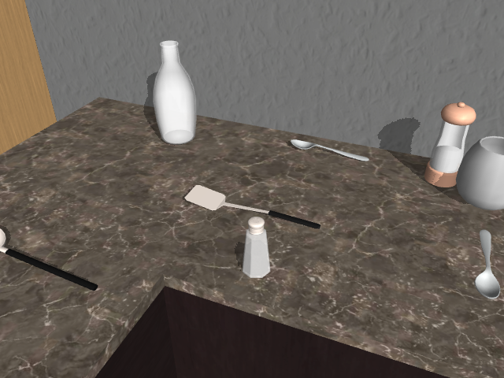

图 3-2：case1 接受样本的编辑前后 head。**目标锅铲未收到移动命令，被移动的是盐罐障碍。**

表 3-3 静置前后世界坐标

| 对象 | 编辑前 (x, y, z) m | 静置后 (x, y, z) m |
|---|---|---|
| 锅铲（目标） | (6.161114, 3.866731, 0.947213) | (6.161114, 3.866731, 0.947213) |
| 盐罐（障碍） | (5.851764, 3.709517, 1.036608) | (6.522233, 4.149743, 1.036628) |

盐罐水平位移约 **0.802 m**；锅铲在所列精度下不变。
**归因**：接受样本实为「把盐罐挪到锅铲后侧」，构造检查通过，但**很可能不满足 case1 原始定义**（该定义要求整条边都够不着、须换边）。

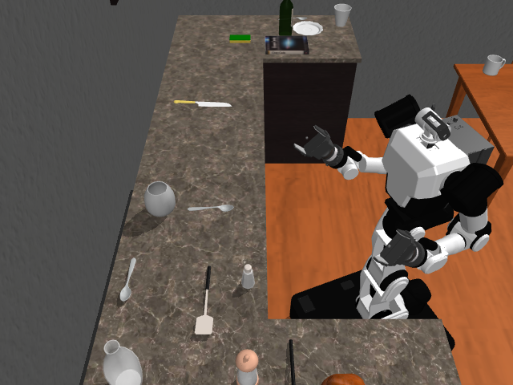


图 3-5：case1 前后辅助图（同名相机、同一 pair_id）。

#### 切片 2：case1.5 的尺度失配

> case1.5 描述： 构造同一目标周围三个方向的差异：A 位置因家具或障碍布局太窄，底盘无法合法到达或站立；B 面虽然能够接近，但机械臂难以到达并抓取目标；C 面有更合适的站立和操作空间，调整底盘到 C 面后抓取表现更好。

表 3-2 椅子实测尺寸 vs 所写区域

| 项 | 数值 | 结果 |
|---|---|---|
| Chair_205_1 实测宽×深×高 | 0.416951 × 0.467975 × 0.874939 m | loadable |
| Chair_210_1 实测宽×深×高 | 0.625608 × 0.486624 × 0.832251 m | loadable |
| Agent3 所写 y 区间跨度 | **0.19 m** | 9 个候选全部 `SearchExhausted: footprint_exceeds_region_or_xy_constraint` |

**归因**：Agent **无从知道**「窄到放不下底盘」对应多少米 —— 隐含约束缺失。

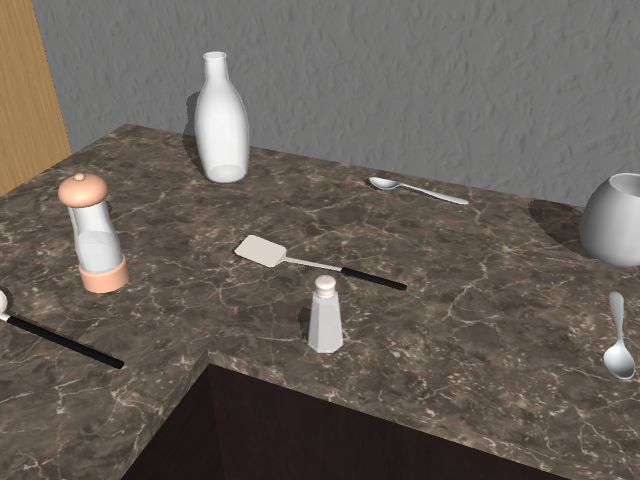
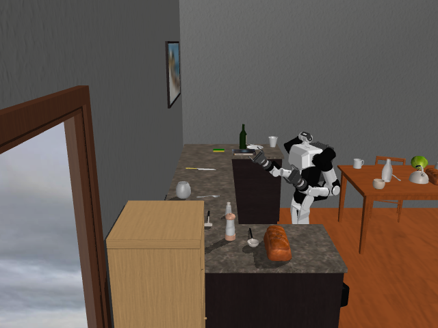

图 4-4：case1.5 第一轮的构造前观察
注意这是**构造前**图，本轮**没有产生任何编辑后图**；背墙区域覆盖仍不足，


第二轮独立重跑：真实 96 次初态试验，**合法且可见 0 个**：

| 拒绝原因 | 次数 |
|---|---:|
| 地面支撑或碰撞不合格 | 67 |
| 目标像素不足 | 17 |
| 目标不在垂直视锥 | 12 |
| **合法且可见** | **0** |

#### 切片 3：case3 的未闭环

> case3描述： 抓取目标的接近、抬升或撤离路径会受到桌面其他物体阻挡，例如需要越过杂乱桌面的物体直接抓取，存在机械臂与环境碰撞风险。可增加真实的小物体资产，但不能仅靠杂物数量或目标距离作为 case 成立证据。

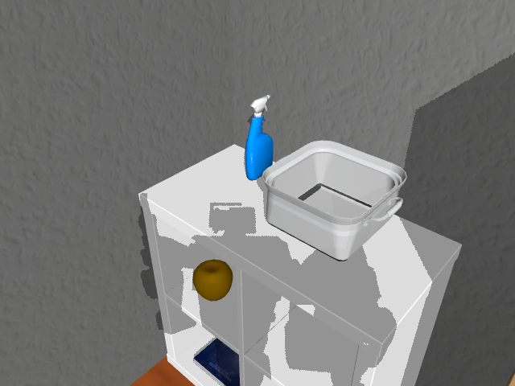
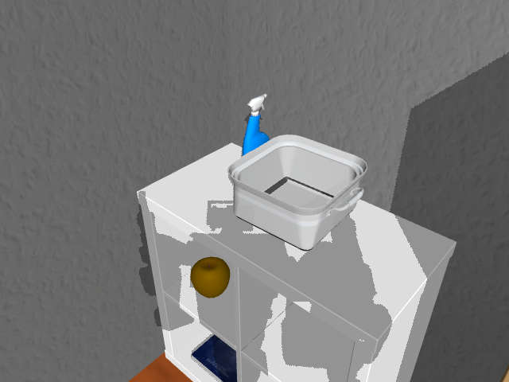

图 3-3：case3 把锅移近喷雾瓶的编辑前后 head。

程序实际移动量（锅水平移动 **0.081968 m**；锅与喷雾瓶的 body 原点水平距离 **0.294117 → 0.228629 m**）：

| 对象 | 编辑前 (x, y, z) m | 静置后 (x, y, z) m |
|---|---|---|
| 喷雾瓶（目标） | (2.359772, 4.144809, 0.897815) | (2.359772, 4.144809, 0.897815) |
| 锅（障碍） | (2.650280, 4.098875, 0.849383) | (2.574758, 4.067014, 0.849383) |

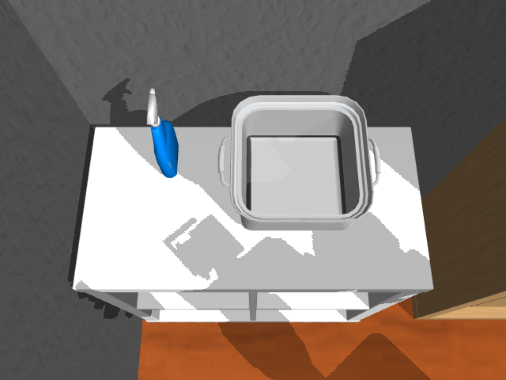
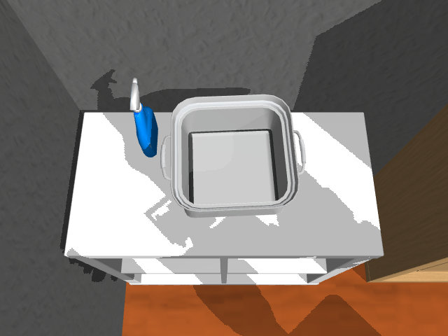

图 3-6：case3 辅助俯视图。


### 3.2 真实运行产出率

表 3-1 四类请求的典型运行

| case | 运行 | 实际状态 |
|---|---|---|
| case1 | `construct-29365f8d6330` | 1 次真实编辑，**1 个构造接受**，4 次 Agent 调用 |
| case1.5 | `construct-1246813fc0b7` | 9 个候选全被足迹约束拒绝；7 次调用，硬期限停止，**0 接受** |
| case1.5 重跑 | `construct-bc802bb13cdb` | 所选书本无合法可见初态，轮数耗尽，**0 接受** |
| case3 | `construct-b1bfbe3383e3` | 7 个候选，末个规则通过并出 6 张 RGB；Reviewer 未闭环，**0 接受** |

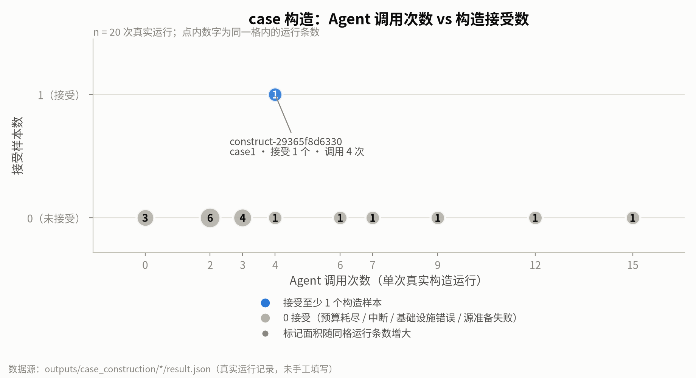

图 4-1 **Agent 调用次数 vs 构造接受数散点图**。


---

## 4. 结果二：站位图与真实成败采集

### 4.1 方法

分层站位采样：**几何过滤 → 规划 → 只对成功点/困难起点/边界点真实执行**。

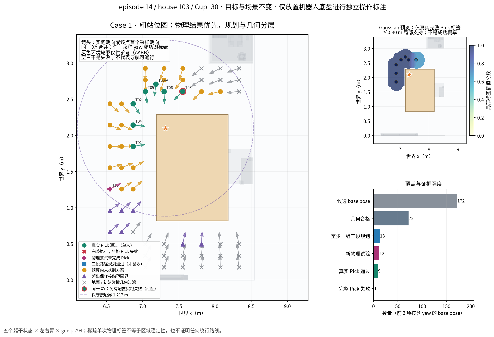

图5.1
这张图的目标是**底盘 affordance 图**——把「哪个底盘位姿能完成任务」直接画成空间场，
后续底盘移动路线的构造就依赖**从低成功率区域走向高成功率区域**。

### 4.2 结果


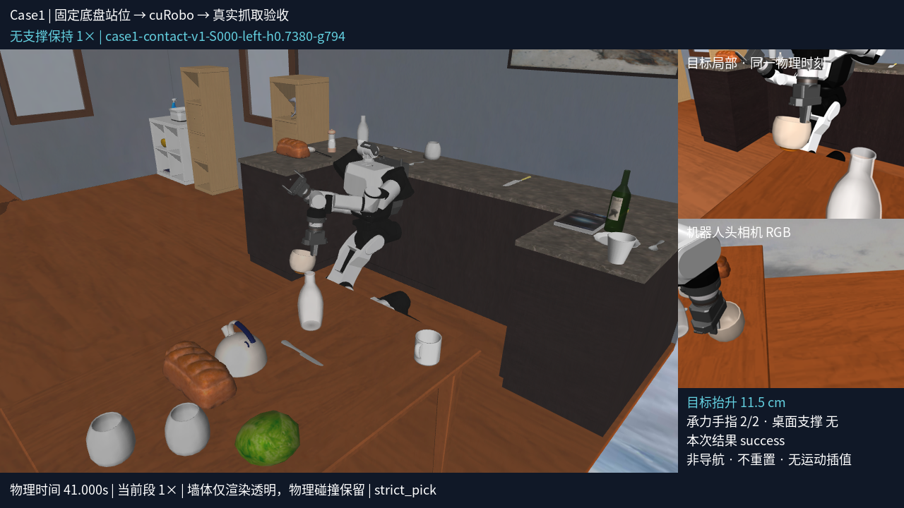
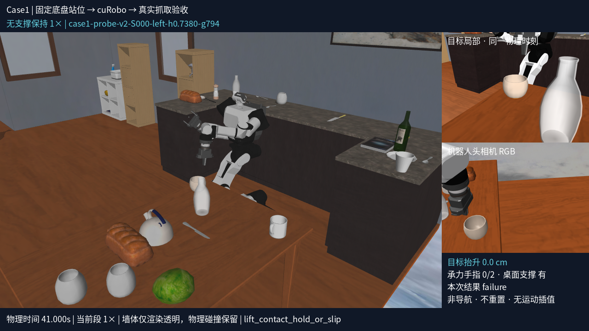


配套交付视频

- [严格成功：抬升 11.54 cm / 无支撑保持 3.52 s](./figures/video5-1a-strict-success.mp4)
- [抓持失败（0 mm 对照）：最大抬升 0.016 cm / 无支撑保持 0 s](./figures/video5-1b-grasp-failure-0mm.mp4)


### 4.3 站位图要说明什么：底盘 affordance 图

**站位图的用途，是构造一张底盘的 affordance 图（底盘能力地图）**，而不是单纯展示「哪些点碰巧成功」。

- 图上每个底盘位姿标注的是**该位姿上任务能否达成**：绿色=至少一个配置真实成功，
  红方块=同点还有执行失败，橙色=有限预算内规划无解，灰色=未测/被几何过滤。
- 这张图给出的是**任务成功率的空间场**：哪些区域高，哪些区域低，哪些区域尚未探明。
- **它是后续底盘移动/导航路线构造的直接依据**：路线规划要沿着**由低成功率区域走向高成功率区域**的方向选择目标站位，
  即「从当前位置这个低成功率站位，移动到那个高成功率站位」。
- 因此站位图必须保留**未测与无解**两类状态，不能只画成功点——不然路线规划会误把「没测过」当成「走不通」，
  或者把「预算内无解」当成「物理不可达」，从而错误地绕开本可通行的区域。

> 本报告图 5-2 是**单侧臂 × 3 躯干高度 × 单一 grasp** 下的第一次稀疏采样（28 个位姿、78 个配置未测），
> 只是这张 affordance 图的**初始快照**，还不足以支撑实际路线规划；右臂、其他 grasp、连续躯干与更多 yaw 均待补测。


右臂尚无真实执行；其他 grasp、连续躯干、更多 yaw 均未穷举。

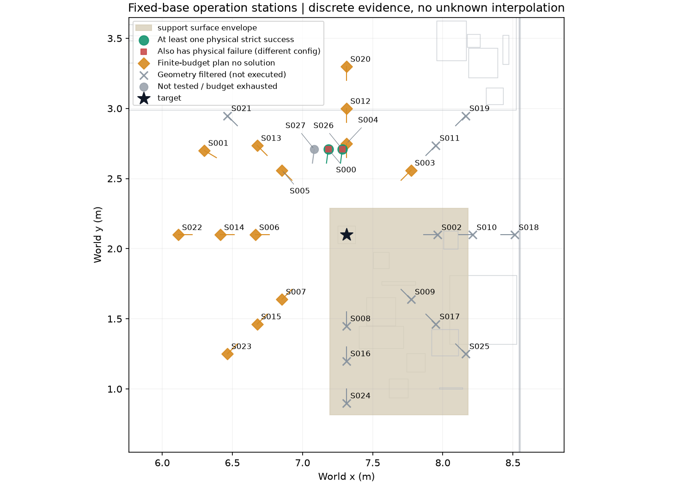、

图 5-2：固定底盘离散站位图


---

## 6. 失败归因：自然语言 case 描述缺少可计算、可验证的操作化定义

**失败链条**：

```text
语言歧义 → 隐含约束缺失 → Agent 自行猜测 → 构造结果不稳定 → 难以验证 case 是否真正成立
```

图 6-1 因果链示意图

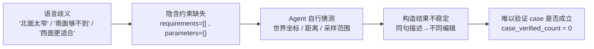

**要点 1：语言歧义带来多义解释**
「北面太窄」「南面够不到」「西面更适合抓」对人很好理解，对 Agent 却不唯一：
「太窄」到底是多少米？「够不到」是 IK 无解还是规划碰撞？「更适合」是成功率更高，还是仅仅存在一条可行轨迹？
于是 Agent 只能自行补全这些隐含条件，最终**同一句描述被转成完全不同的场景编辑**。

**要点 2：任务定义不够可执行**
Case Template 停在自然语言层，`requirements`、`parameters` 等关键约束**为空**，
Agent3 需要自行猜测坐标、距离和采样范围。

**要点 3：Agent 承担了过多本应程序化的判断**
可达性、碰撞、站位空间都可由几何计算确定，不适合让 LLM 猜测；
因此**结果不稳定、成本高，也难以保证规模化生成质量**。


---

## 7. 问题

1. 整个数据管线设计缺乏理论支撑，如何证明数据管线的设计是合理的、可推广的？
2. 自然语言 case 描述的是一种模式，过于抽象，容易引起歧义， 缺少更具体的可计算、可验证的操作化定义。 接口输入应该重新定义。
3. agent方法的成本问题，目前没有依赖多轮交互，都是单次问答，消耗不大。


---

## 附录

### D.1 Case Template（Agent1 输出）——「需求」被翻译成什么

```json
{
  "template_version": "0.1",
  "case_type": "case1",
  "task_type": "pick",
  "objective_mode": "beneficial_reposition",
  "source_description": "由于目标、支撑家具和周围障碍的几何布局，原来的接近或工作位置不利于抓取，需要通过底盘平移和转向调整到更合适的工作位置。请构造实际空间或接近方向的差异，不能仅把目标移得更远。",
  "intent": "保留目标、支撑家具与周围障碍形成的几何布局差异，使原接近或工作位置不利于抓取，并通过更有利的底盘平移与转向工作位置改善接近条件；不得仅通过增大目标距离构造差异。",
  "roles": {
    "target":         { "required": true, "type": "manipulable_object" },
    "support":        { "required": true, "type": "support_surface" },
    "obstacle":       { "required": true, "type": "obstacle_object" },
    "robot_station":  { "required": true, "type": "robot_station" }
  },
  "invariants": [
    { "predicate": "supported_by", "args": ["$target", "$support"],
      "required": true, "tolerance": 1e-06, "value": true }
  ],
  "requirements": [],
  "parameters":   {},
  "assumptions": [
    "图片、静态几何和代理条件不能证明底盘可达、机械臂可达、真实路径无碰撞或抓取成功率",
    "未提供具体尺寸、距离、角度或机械臂可达阈值，因此不设定数值范围",
    "完整物理场景中的其他物体仍可能影响底盘、机械臂和抓取路径，局部布局描述不表示范围外没有障碍",
    "支撑关系仅在完整操作组静置后的编辑前和编辑后检查，不要求中间步骤始终保持该关系"
  ],
  "semantic_checks": [
    "编辑前后目标、支撑与障碍的相对空间布局发生可见变化，形成不同的接近方向或工作位置条件，而不是仅使目标远离机器人",
    "至少存在障碍位于目标相对于可用工作区域的某一侧，使原有接近或工作位置与调整后的有利工作位置具有几何差异",
    "编辑前后目标仍位于支撑表面上并保持同一抓取任务对象"
  ],
  "task_hypotheses": [
    "需要通过底盘平移和转向改变机器人相对于目标、支撑和障碍的工作位置，而非仅把目标移得更远",
    "原始几何布局使接近或工作位置不利于抓取，调整后的布局应提供不同且更有利的接近方向或工作位置",
    "底盘是否可达调整后的工作位置、机械臂是否可达目标、接近路径是否碰撞以及抓取是否成功，必须通过实际仿真或执行验证",
    "只有在正式任务中允许底盘平移和旋转并比较任务结果后，才能验证重新定位是否带来抓取收益"
  ],
  "pending_hypotheses": [
    "底盘平移和转向是否能到达更有利的工作位置未知",
    "调整后的工作位置是否改善机械臂接近与抓取未知",
    "真实场景中的路径碰撞风险未知"
  ]
}
```

**逐字段注释**

| 字段 | 真实内容 | 注释 |
|---|---|---|
| `source_description` | 用户原话，一字不改 | 保留原始输入，便于追溯 Agent 是否忠实翻译 |
| `intent` | 改写后的一段意图 | 仍是**自然语言**，程序无法解析 |
| `roles` | 4 个抽象角色 | **只有角色类型，没有资产 ID、没有坐标**——绑定留给后续 Agent2/Agent3 |
| `invariants` | **只有 1 条** `supported_by($target,$support)` | 这是整份模板里**唯一能被程序执行**的断言 |
| **`requirements`** | **`[]`（空）** | ← **关键**：可执行的成立条件为空 |
| **`parameters`** | **`{}`（空）** | ← **关键**：任何数值范围、阈值都没有 |
| `assumptions` | 4 条 | 第 2 条是**自我供述**：*「未提供具体尺寸、距离、角度或机械臂可达阈值，因此不设定数值范围」* |
| `semantic_checks` | 3 条自然语言 | 描述「应该发生什么」，但**程序无法据此检查** |
| `task_hypotheses` / `pending_hypotheses` | 4 + 3 条 | 明确标注「必须通过实际仿真或执行验证」「未知」——**没有把假设当结论** |


### D.2 Construction Plan（Agent2 输出）——「选哪里、往哪改」

```json
{
  "context_id": "context:spatula_291e31b285474249721c8a7b1bac877a_1_0_2",
  "decision": "select",
  "radius_m": 2.5,
  "edit_directions": ["move", "rotate"],
  "asset_requests": [],
  "rationale": "该候选明确验证了锅铲由台面支撑，且目标周围已有多个台面物体可作为障碍。通过移动并旋转现有障碍可改变目标、支撑面和障碍之间的侧向布局，同时保留目标和支撑家具，不依赖单纯增大目标距离。台面后侧邻近墙体，前侧和侧向工作区域具有可对比的几何条件。",
  "expected_layout": "保留锅铲位于台面上的支撑关系，将现有台面障碍重新布置到目标一侧并调整其朝向，使靠墙或台面后侧的接近方向受限，而台面前侧保留不同的候选工作位置；编辑不应仅增加目标与机器人之间的距离。",
  "contrast_spec": [
    { "role": "base_space_constrained",
      "work_region_id": "context:spatula_..._1_0_2/y_plus",
      "expected_mechanism": "台面后缘邻近墙体，目标后侧工作区域的底盘站位空间可能受限，形成与前侧不同的平移和转向条件。" },
    { "role": "arm_unfavorable",
      "work_region_id": "context:spatula_..._1_0_2/x_plus",
      "expected_mechanism": "将障碍布置在目标朝向该侧的接近扇区后，该方向可能需要绕过障碍或采用不利的机械臂姿态；机械臂可达性和抓取结果仍需验证。" },
    { "role": "preferred",
      "work_region_id": "context:spatula_..._1_0_2/y_minus",
      "expected_mechanism": "台面前侧提供与后侧不同的接近方向，底盘可通过平移和转向尝试从该侧建立工作位置；实际可达性和路径安全未知。" }
  ],
  "unverified_claims": [
    "工作区域中心仅是几何搜索提示，不证明底盘能够站立、到达或安全旋转。",
    "编辑后的机械臂可达性、接近路径碰撞风险和抓取成功均未验证。",
    "完整场景中的其他台面物体、家具和墙体仍可能影响底盘及机械臂路径。",
    "移动障碍后目标仍保持在台面上的支撑关系需要由程序在编辑后检查。"
  ]
}
```

**逐字段注释**

| 字段 | 真实内容 | 注释 |
|---|---|---|
| `context_id` | 选中的是**锅铲**所在上下文 | 程序给出的候选，Agent2 从中选一个 |
| `rationale` | 一段自然语言理由 | 说明为什么选它；注意其中「不依赖单纯增大目标距离」是**从描述里抄回来的约束** |
| `edit_directions` | `["move","rotate"]` | 只用**已有物体**的移动与旋转，不新增资产 |
| `asset_requests` | `[]` | 本例不请求新增资产 |
| `expected_layout` | 自然语言 | 「应该变成什么样」——**仍是描述，不是断言** |
| **`contrast_spec`** | 3 条，role 分别为 `base_space_constrained` / `arm_unfavorable` / `preferred` | ← **关键**：这三条正是 **case1.5 的 A/B/C 三侧**（太窄 / 臂不可达 / 更合适） |
| `work_region_id` | `.../y_plus`、`.../x_plus`、`.../y_minus` | 只是**几何搜索提示**，不等于可站立区域 |
| `expected_mechanism` | 自然语言，且每条都以「可能受限」「仍需验证」「未知」收尾 | 描述的是**期望机制**，不是已测事实 |
| `unverified_claims` | 4 条 | 第 1 条自认 `work_region_id` 不证明能站；第 2 条自认可达性/碰撞/抓取**全未验证** |

> **这里能直接看到定义漂移的现场。** case1 的原始定义是「距离超出可达范围」，
> 但这份 case1 的 `contrast_spec` 写出来的是 **A/B/C 三侧对比**——那是 case1.5 的机制。
> 也就是说，**同一套模板结构被套用到不同 case 上**，而程序无法察觉，因为 `expected_mechanism` 是自然语言、没有判定量。

### D.3 从 Plan 到实际编辑（以及为什么最后没验证 case）

Construction Plan 里的角色在 Agent3 处被绑定到**真实实例**（`sample.json → proposal.bindings`）：

| 抽象角色 | 绑定的真实实例 | 场景类别 | 实际发生了什么 |
|---|---|---|---|
| `$target` | `spatula_291e31b285474249721c8a7b1bac877a_1_0_2` | Spatula | **没有收到移动命令**（坐标编辑前后不变） |
| `$support` | `countertop_aa26fd5b3d56251659034cbb8b20053d_1_0_2` | CounterTop | 保持 |
| `$obstacle` | `saltshaker_4a6645cf2cdf6c8afa19b4998a0f4061_1_0_2` | SaltShaker | **被移动到目标后侧**（水平位移约 0.802 m） |
| `$robot_station` | `station_start` | — | 实际初始化后的机器人基座参考 |

Agent3 最终只产出了**一条**操作，且是**范围型** DSL 而非确定值：

```json
{ "op": "move", "subject": "$obstacle",
  "search_space": {
    "region": "countertop_..._collision_2:top",
    "support": "$support",
    "xy": { "mode": "uniform", "margin": 0.03,
            "x": [-1.1, -0.45], "y": [0.1, 0.24] },      // ← Agent 自己编的采样范围
    "rotation": { "axis": [0,0,1], "frame": "world",
                  "angle": { "range": [-0.6, 0.6] } } } }
```

程序按种子 42 采样，落到：局部 xy = `[-0.4728, 0.2056]` m、绕竖直轴 `+0.583 rad (≈ +33.4°)`。

**最终三层结论**（`sample.json` / `result.json`）：

| 层 | 结果 |
|---|---|
| 场景与构造 | `valid` / `pass`，`construction_accepted` |
| 可见语义 | `pass`（Agent4 三项布局检查通过） |
| **case 成立** | **`unknown`；`case_verified_count = 0`** |
| 机器人任务 | `unknown`（`not_tested`，本阶段 `construction_only`） |

### D.4 这两份文件合起来说明了什么

| 观察到的事实 | 对应第 6 节的因果链环节 |
|---|---|
| `requirements=[]`、`parameters={}`；`assumptions` 自认「未提供阈值，故不设数值范围」 | **隐含约束缺失** |
| `semantic_checks` / `expected_mechanism` 全是自然语言，程序无法执行 | **语言歧义** |
| Agent3 不得不自己写出 `x:[-1.1,-0.45]`、`angle:[-0.6,0.6]` 这类采样范围 | **Agent 自行猜测** |
| case1 的 `contrast_spec` 写成了 case1.5 的 A/B/C 三侧 | **构造结果不稳定**（同一结构被套用到不同 case） |
| 三层结论里 `case_condition = unknown`、`case_verified_count = 0` | **难以验证 case 是否真正成立** |

### D.5 Scene Graph 交互式可视化

前面 D.1–D.4 讲的是 Template 与 Plan，而这两者之间还有一个关键产物：**Scene Graph**。
它是从真实仿真里**实测**出来的场景快照，用 `[scene-graph.html](./scene-graph.html)` 打开可交互查看

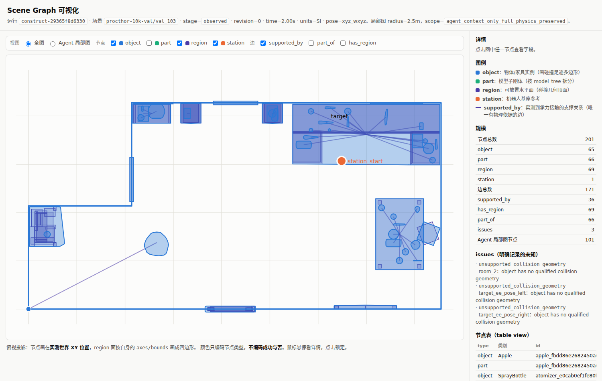

图 D-1：`construct-29365f8d6330` 全图（201 节点 / 171 边）的俯视投影。节点画在**实测世界 XY 位置**上，
region 面按自身 `axes/bounds` 画成四边形。**颜色只编码节点类型，不编码成功与否。**


### D.6 DSL原子操作

| 操作     | 必需字段                                    | 语义                               | 备注                                         |
| -------- | ------------------------------------------- | ---------------------------------- | -------------------------------------------- |
| `move`   | `subject`、`search_space`                   | 把已存在实例移到某支撑面上的新位姿 | 可选 `carry_supported`（是否连带处理依附物） |
| `rotate` | `subject`、`axis`、`angle`                  | **只转不移**——相对旋转             | 有硬检查：旋转不得改变位置（见下）           |
| `add`    | `bind_as`、`asset_selector`、`search_space` | 从资产池新增一个实例               | `bind_as` 必须新建 `$role`，不能重名         |
| `remove` | `subject`                                   | 删除实例                           | 运行时映射为 `delete`                        |

坐标系：

| 阶段                     | 坐标系                                                               | 约束                                                                                    |
| ------------------------ | -------------------------------------------------------------------- | --------------------------------------------------------------------------------------- |
| **Symbolic（范围型）**   | **支撑面的区域局部系**（`region` 自带 `origin` + `axes` + `bounds`） | `xy` 是**面局部**的矩形范围；`rotation.axis` 有 `frame: world \| object`                |
| **Executable（确定型）** | **世界系**                                                           | `validate_pose()` 硬性要求 `pose['frame'] == 'world'`，四元数 `wxyz` 必须归一化（2e-6） |

